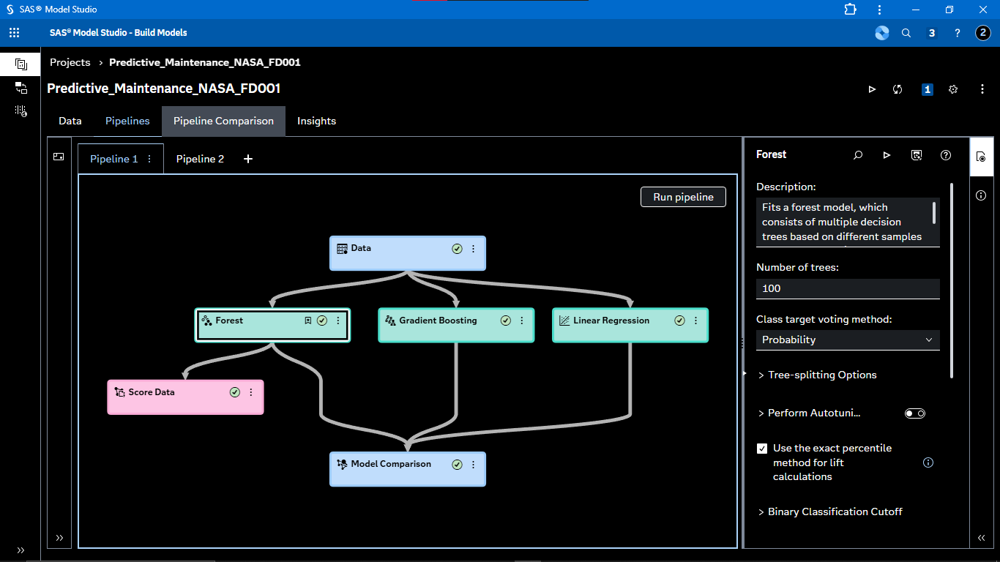
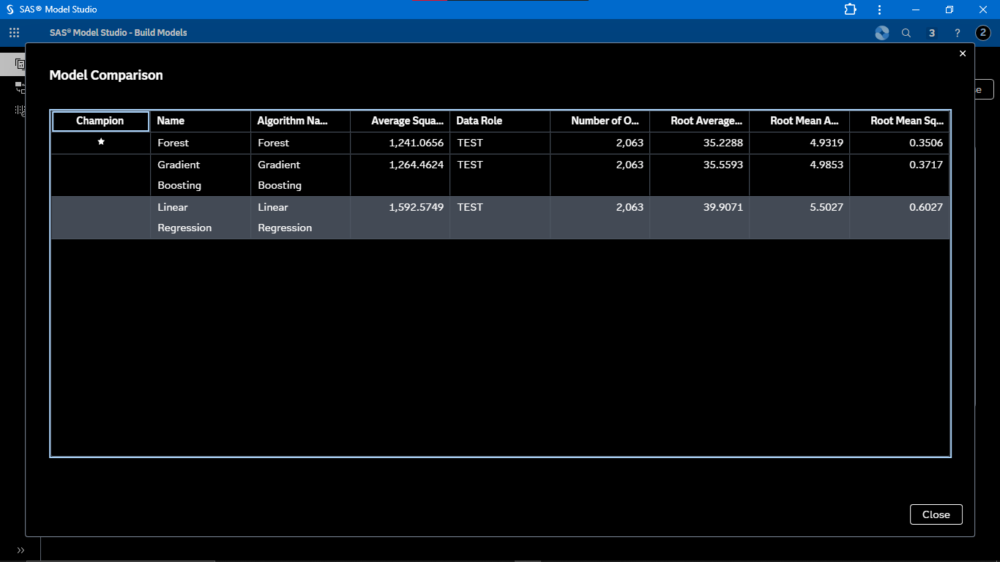
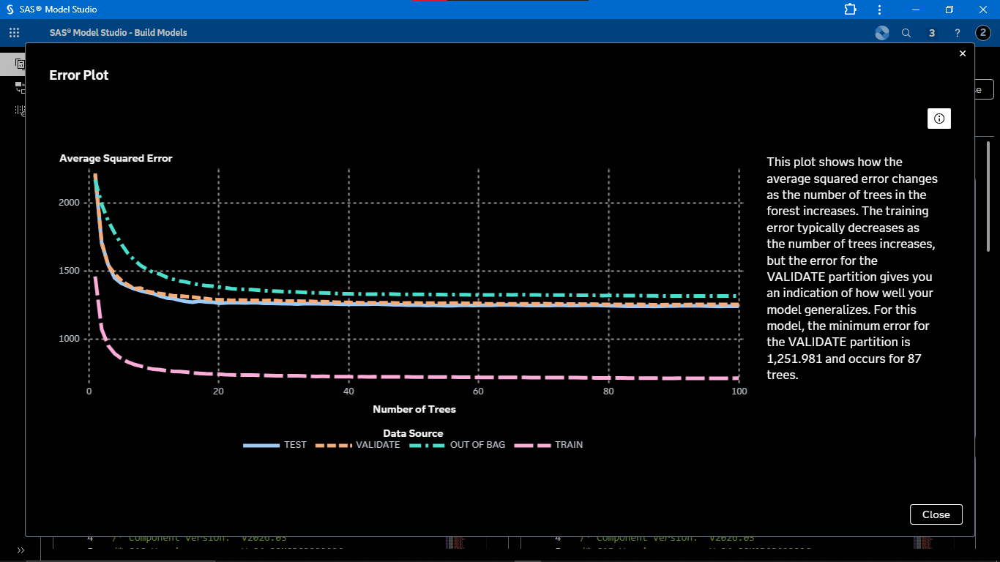
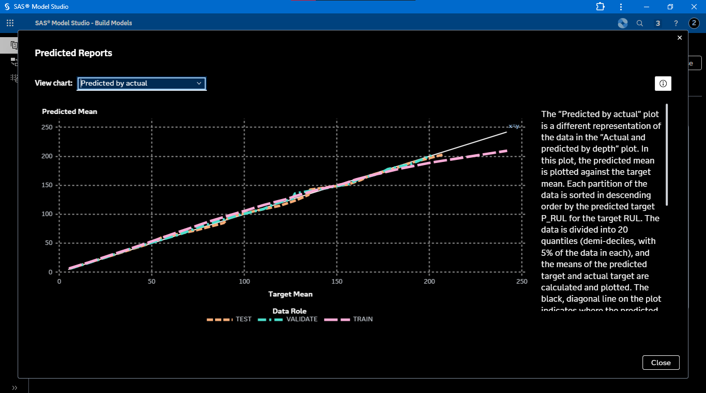
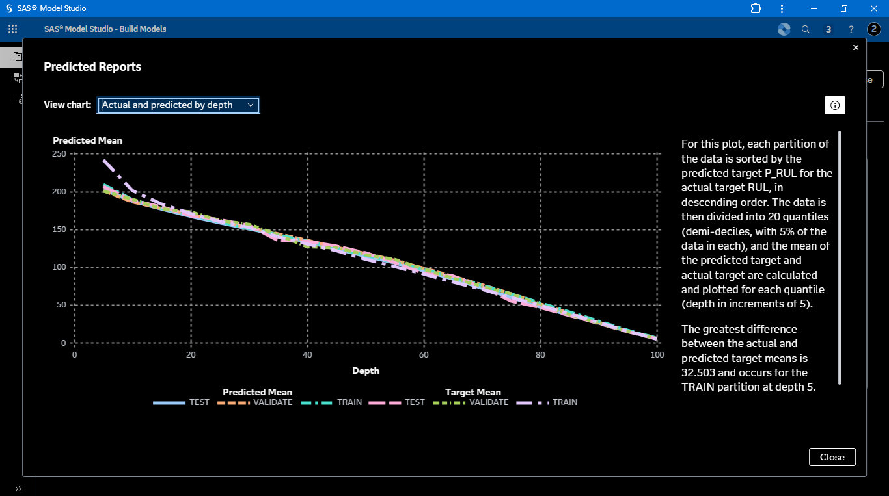
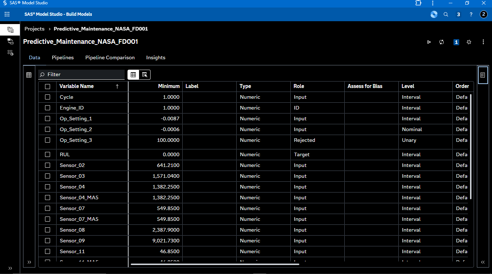
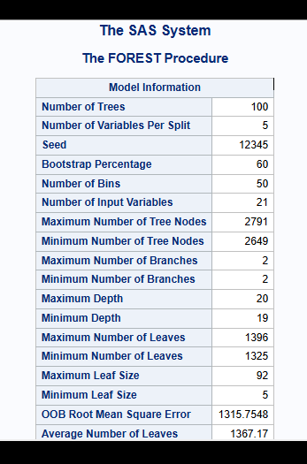

# NASA C-MAPSS Predictive Maintenance using SAS Viya

An end-to-end predictive maintenance project using the NASA C-MAPSS turbofan engine degradation dataset, SAS Viya, and SAS Model Studio to predict Remaining Useful Life (RUL) of aircraft engines.

## Project Overview

Predictive maintenance uses historical sensor and operational data to identify equipment degradation and estimate when maintenance may be required.

This project uses simulated aircraft engine degradation data from the NASA C-MAPSS dataset and develops a machine learning workflow for Remaining Useful Life prediction.

The complete workflow covers:

- Data preparation
- Feature engineering
- Moving-average feature creation
- Model preparation
- Machine learning model development
- Model comparison
- Model evaluation
- Model management

## Technology Stack

- SAS Viya
- SAS Model Studio
- SAS Model Manager
- SAS Programming
- Machine Learning
- Regression
- Feature Engineering
- Time-Series Sensor Analysis

## Dataset

The project uses the NASA C-MAPSS FD001 turbofan engine degradation dataset.

The data contains multivariate sensor measurements collected over multiple operating cycles for simulated aircraft engines.

### Main datasets

| Dataset | Purpose |
|---|---|
| `TRAIN_FD001` | Training data used for model development |
| `TEST_FD001` | Test data used for final scoring |
| `RUL_FD001` | Remaining Useful Life values for test engines |

## Dataset Variables

The modeling data contains:

- `Engine_ID` — Identifies the aircraft engine
- `Cycle` — Operating cycle of the engine
- `Op_Setting_1` — Operational setting 1
- `Op_Setting_2` — Operational setting 2
- `Op_Setting_3` — Operational setting 3
- `Sensor_01` to `Sensor_21` — Engine sensor measurements

Additional engineered variables include moving-average features such as:

- `Sensor_04_MA5`
- `Sensor_07_MA5`
- `Sensor_11_MA5`
- `Sensor_12_MA5`

## Project Workflow

```text
NASA C-MAPSS Dataset
        |
        v
Data Preparation
        |
        v
Feature Engineering
        |
        v
Moving-Average Features
        |
        v
Model Preparation
        |
        v
Model Development
        |
        +-------------------+
        |                   |
        v                   v
      Forest        Gradient Boosting
        |
        +-------------------+
        |
        v
Linear Regression
        |
        v
Model Comparison
        |
        v
Model Evaluation
        |
        v
SAS Model Manager
        |
        v
RUL Prediction
````

## Feature Engineering

Sensor time-series data was processed to create additional predictive features.

Five-cycle moving averages were generated for selected sensor variables to capture short-term degradation trends and reduce the effect of individual sensor fluctuations.

Examples include:

```text
Sensor_04_MA5
Sensor_07_MA5
Sensor_11_MA5
Sensor_12_MA5
```

## Machine Learning Models

Three regression approaches were developed and compared:

### 1. Forest

A tree-based ensemble model used to capture nonlinear relationships between engine operating conditions, sensor measurements, and RUL.

### 2. Gradient Boosting

An ensemble learning approach that builds sequential decision-tree models to improve predictive performance.

### 3. Linear Regression

A baseline regression model used to establish a simple relationship between the engineered predictors and Remaining Useful Life.

## Model Evaluation

Models were evaluated using validation data.

The project considers standard regression metrics including:

* R-Squared
* Root Mean Squared Error (RMSE)
* Mean Absolute Error (MAE)

Model comparison is performed in SAS Model Studio to identify the most appropriate predictive model.

## Project Evidence

The following screenshots document the end-to-end SAS Viya modeling workflow used in this project.

### SAS Model Studio Pipeline



The pipeline connects the prepared dataset to multiple predictive models, followed by scoring and model comparison.

### Model Comparison



Forest, Gradient Boosting, and Linear Regression were evaluated using the same modeling workflow. The Forest model was selected as the champion based on the displayed test-set performance.

### Forest Error Plot



The error plot shows how the average squared error changes as the number of trees increases. The validation partition reaches its minimum error at 87 trees in the displayed model configuration.

### Predicted vs Actual RUL



The predicted-versus-actual plot provides a visual assessment of how closely the model predictions follow the observed RUL target across the data partitions.

### Prediction by Depth



This visualization compares predicted and actual target means across model depth, providing additional insight into prediction behavior.

### Model Input Configuration



The SAS Model Studio data view shows the variable roles used for modeling, including `RUL` as the target, `Engine_ID` as the identifier, and the engineered moving-average variables.

### Forest Procedure Output



The Forest procedure output documents the configuration of the final Forest model, including the number of trees, input variables per split, bootstrap percentage, and tree-depth parameters.

## Model Interpretability

The Forest model identified several influential variables.

The major influential variables included:

1. `Cycle`
2. `Sensor_11`
3. `Sensor_11_MA5`
4. `Sensor_04`
5. `Sensor_12`

These variables provide important information about engine degradation and Remaining Useful Life.

## SAS Model Manager

The final model was reviewed using SAS Model Manager.

The model-management stage includes:

* Model health review
* Validation performance
* Generalizability assessment
* Influential-variable analysis
* Model documentation
* Deployment-readiness review

## Repository Structure

```text
nasa-cmapss-predictive-maintenance-sas-viya/
│
├── data/
│   └── README.md
│
├── sas-code/
│   ├── 01_data_preparation.sas
│   ├── 02_feature_engineering.sas
│   ├── 03_model_preparation.sas
│   ├── 04_model_development.sas
│   ├── 05_model_evaluation.sas
│   ├── 06_model_manager.sas
│   └── README.md
│
├── LICENSE
└── README.md
```

## Results

The project successfully demonstrates an end-to-end predictive maintenance workflow in SAS Viya.

The workflow progresses from raw engine-cycle and sensor data through feature engineering, machine learning model development, validation, model comparison, and model management.

## Key Learning Outcomes

Through this project, the following concepts were implemented:

* Predictive maintenance
* Remaining Useful Life prediction
* Multivariate time-series sensor analysis
* Feature engineering
* Moving-average features
* Regression modeling
* Ensemble machine learning
* Model comparison
* Model validation
* Model interpretability
* SAS Model Studio
* SAS Model Manager

## Future Improvements

Potential extensions include:

* Hyperparameter optimization
* Additional degradation features
* Alternative machine learning algorithms
* Improved RUL-specific evaluation
* Automated model retraining
* Real-time sensor scoring
* Production deployment
* Monitoring model drift

## License

This project is licensed under the MIT License.
